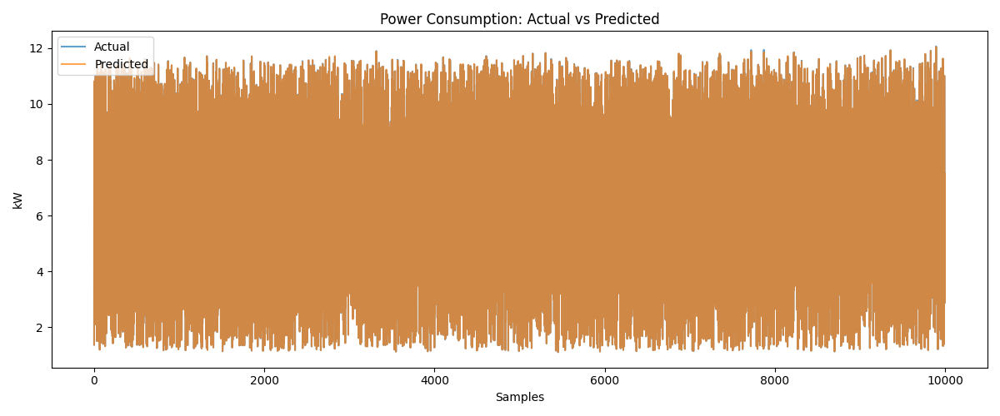
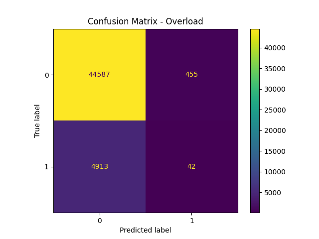
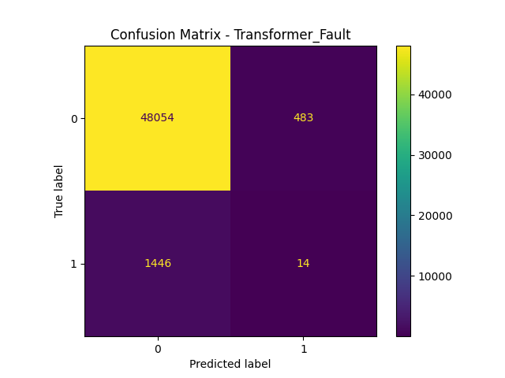

# ⚡ Smart Grid Power Consumption Predictor

This project predicts power consumption using machine learning on smart grid data, and also detects anomalies such as overloads and transformer faults.

## 📊 Description

- Trains an XGBoost regression model on smart grid sensor data
- Makes predictions on new unseen data
- Detects anomalies using One-Class SVM (e.g., Overload, Transformer Fault)
- Visualizes results and exports prediction and anomaly CSVs

---

## 🌍 Real-World Impact

This model helps monitor and optimize smart grid energy usage, detect faults early, and prevent blackouts. It's built to simulate how power companies can make data-driven decisions in real-time.


## 🚀 Workflow

### 🔹 Step 1: Train the Model

Trains on `smart_grid_dataset1.csv` and outputs:
- `xgb_model.joblib` (saved model)
- RMSE and R2 of the model
- Confusion matrices for anomaly detection (for the test split of the dataset)

```bash
python ai_smart_grid_model10.py
```

### 🔹 Step 2: Predict on New Input

Uses main.py to run predictions on new test data (like input_dataset.csv) using the trained model.
```bash
python main.py
```

It will ask:
- 📂 Enter path to the new input CSV file: input_dataset.csv
- 🧠 Enter path to the trained XGBoost model (.joblib): xgb_model.joblib

This will output the following:
- Power predictions CSV file
- Anomaly confusion matrices and power plot

## 🧠 Features Used in Modeling

The features used in the model:
- Time-based: Hour of day, Day of week, lag features
- Environmental: Temperature², Solar/Wind ratio, humidity interaction
- Economic: Net grid usage, price elasticity
- Anomaly Detection: One-Class SVM on voltage, current, and faults

## 📁 File Descriptions

The file names with their respective roles:
| File                       | Description                                     |
| -------------------------- | ----------------------------------------------- |
| `ai_smart_grid_model10.py` | Trains XGBoost model and runs anomaly detection |
| `main.py`                  | CLI to make predictions on new CSV inputs       |
| `smart_grid_dataset1.csv`  | Training dataset                                |
| `input_dataset.csv`        | Sample test dataset for prediction              |
| `requirements.txt`         | Python dependencies                             |

## 🔧 Installation

run the requirements.txt:

```bash
pip install -r requirements.txt
```

## 📷 Output Examples

These are the outputs of the model.py and the main.py:
- 📈 Power consumption prediction plot
- 📊 Confusion matrices for anomaly detection
- 📄 CSVs with predictions and anomaly flags

## 🛠️ Technologies Used

The language and the modules used are:
- Python
- Pandas, NumPy
- XGBoost, scikit-learn
- Matplotlib, Seaborn
- Joblib

## 🔄 Model Evolution: From Model 1 to Model 10

This project is the result of iterative experimentation and improvement over 10 different models. Below is a brief summary of what was tried and learned:

## 🚀 Model Evolution

| Model Name               | Focus / Description                                                                 | Techniques Used                                              | Key Improvement                                           |
|--------------------------|--------------------------------------------------------------------------------------|--------------------------------------------------------------|-----------------------------------------------------------|
| `ai_smart_grid_model1`   | Basic power regression and fault classification                                     | RandomForest, SMOTE, Excel + plots                           | Established initial pipeline and evaluation setup         |
| `ai_smart_grid_model2`   | Added overload classification and script-based output folders                       | LinearRegression, RandomForest, output structuring           | Multi-task learning and output management                 |
| `ai_smart_grid_model3`   | Precision-optimized fault detection                                                 | XGBoost, SMOTE, GridSearchCV, PR curve                       | Lowered false positives using precision threshold         |
| `ai_smart_grid_model4`   | Used class weights instead of SMOTE, with a fixed threshold                         | XGBoost, `scale_pos_weight`, fixed threshold (0.70)          | Simplified model with better generalization               |
| `ai_smart_grid_model5`   | Smart threshold search to minimize FP and FN                                        | XGBoost, auto thresholding, fallback logic                   | Adaptive decision threshold for fault detection           |
| `ai_smart_grid_model6`   | Switched to LightGBM, faster and scalable                                           | LightGBM, fixed threshold (0.75), class weight               | Improved speed, tuned for FP < 500 and FN < 150           |
| `ai_smart_grid_model7`   | Used ADASYN for better minority class learning                                      | LightGBM, ADASYN, smart thresholding                         | Improved minority handling and robustness                 |
| `ai_smart_grid_model8`   | Combined SMOTE + Tomek for cleaner decision boundaries                              | XGBoost, SMOTE-Tomek, standard evaluation                    | Cleaner class boundaries and reduced overlap              |
| `ai_smart_grid_model9`   | Unsupervised anomaly detection with Isolation Forest                                | IsolationForest, XGBoost for power regression                | Labeled-data-free fault detection experiment              |
| `ai_smart_grid_model10`  | Final model with feature engineering + anomaly detection + encryption               | XGBoost, One-Class SVM, advanced features, encryption        | Final modular, secure, and deployable version             |

### 📌 Final Takeaways:
- XGBoost gave the best tradeoff between accuracy and training time
- Feature engineering had the **biggest impact** on model quality
- Anomaly detection adds practical value for smart grid systems
- Iteration helped me understand trade-offs between models

## 📦 Sample Output Results (Model 10)

After running `ai_smart_grid_model10.py`, the final model generated:

- ✅ **Model saved to**: `xgb_model.joblib`
- 📊 **Final XGBoost Evaluation**:
  - 🔹 **MSE**: 0.0002  
  - 🔹 **RMSE**: 0.0123  
  - 🔹 **R² Score**: 1.0000 (Perfect fit 🎯)

- 📈 **Power Predictions CSV**  
  `model10_outputs/output_20250527_220054/power_prediction_20250527_220054.csv`

- 🖼️ **Power Prediction Plot**  
  

- 🧩 **Anomaly Detection Confusion Matrices**  
  Detection of `Overload` and `Transformer_Fault` using One-Class SVM.

### 🔍 Confusion Matrix – Overload


- TN: **44,587**, FP: **455**, FN: **4,913**, TP: **42**

### 🔍 Confusion Matrix – Transformer Fault


- TN: **48,054**, FP: **483**, FN: **1,446**, TP: **14**

- 🛠️ **Anomaly Results CSV**  
  `model10_outputs/output_20250527_220054/anomaly_detection_20250527_220054.csv`

## 👤 Author

Kottapalli Trishanth – B.Tech Student at IIIT Naya Raipur